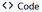
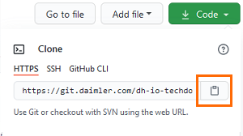
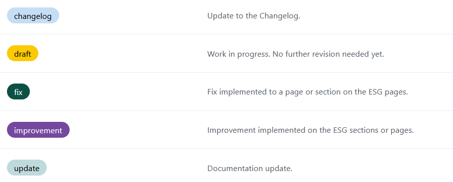

# Getting Started  

**Collaborate with the Ecosystem Guidelines** providing updates, new content or fixes to our different topics, sections and pages.   

**Pick your adventure:**  
  
 


  
??? example "GETTING STARTED"    

	## Prerequisites
			
	1. A [git.daimler.com](https://git.daimler.com) user account.    
	2. Access to the [EcoSystem Guidelines repository](https://git.daimler.com/dh-io-techdocs/ecosystem-guidelines/).  
	3. Github/Git & Markdown fluency.
	4. Git or a Git GUI application.  
	   Note: GitHub Desktop is recommended for non-technical roles.

	### Cloning the Repository  
	 
	=== "Technical Roles"  
		Clone the [Ecosystem Guidelines](https://git.daimler.com/dh-io-techdocs/ecosystem-guidelines.git).    
				  
		**If you can't clone the repository**, request access [here](https://teams.microsoft.com/l/channel/19%3aU4umwdCyw4-hxJ1ESnI9AKOoCJRDCHwaHgrMtuiJsWY1%40thread.tacv2/General?groupId=311445b5-9051-4575-9344-26e2983d2425&tenantId=0399b875-c72e-4e55-9769-78c86428c684). DO NOT FORK.  
				
		  
	=== "Non-Technical Roles"  
		1. Go to [EcoSystem Guidelines repository](https://git.daimler.com/dh-io-techdocs/ecosystem-guidelines/).  
		2. Then  **> Clone > HTTPS**: Copy.      
			
		  

	### Installing the Tools    
	
	1. Download and install [Python 3](https://www.python.org/downloads/).  
	2. Install and upgrade PIP:  
	    
	```shell   
	pip3 install --upgrade pip  
	```   
	3. Installing Mkdocs and Mkdocs-Material:    
	      
	```shell   
	pip install mkdocs      
	pip install mkdocs mkdocs-material-extensions mkdocs-redirects pymdown-extensions
	``` 


	      
??? success "LET'S WRITE"  
 
	=== "Update the Content"    
         
        ## Updating Content  


		1. **Update** (Pull/Fetch) your local Master branch.
		2. **Create a new branch** following this naming convention:  `[GITUSER]-esg-[briefUpdateDescription]-patchN`.  
	    For example: _JAVHER-esg-updatingContributionGuide-patch1_.    
		3. **Edit** your files with a Markdown editor.  
		4. **Commit** leaving an informative message about you changes.    
		5. **Create a PR** and **publish** it.   
		6. In the **Projects** section of the PR window, select _Improvements & PR Management_.  

	    **You will be redirected** to the ESG online Github repository. Once there, **Select:**   
	  
	    - A Required Reviewer to check your Pull Request.  
	    - The _Improvements & PR Management_ project. 
		
    === "Add a New Page"  
		  
        ## Adding a New Page

		1. Open your local `Ecosystem-guidelines\docs\` folder.  
		2. Create the new page folder structure.  
		   **Note:** Mirror the folder structure of other topics.  
		2. In the new folder, add a `index.md` file.  
		3. Add you content and save your changes.
		4. Open `\Ecosystem-guidelines\mkdocs_sidebar.yml` file, and add the new page.  
		5. **Commit** your changes.  
		6. **Create a PR** and **publish** it.   
		7. In the **Projects** section of the PR window, select _Improvements & PR Management_. 


		**You will be redirected** to the ESG online Github repository. Once there, **Select:**   
  
        - A Required Reviewer to check your Pull Request.  
        - The _Improvements & PR Management_ project.       
  
    === "Previsualize Your Work"  
		  
        ## Previsualizing Your Work

		Previsualizing your work provides you a sense of the user`s perspective regarding information structure, findability, etc. It also helps you to spot writting bugs.  

		1. In your **Ecosystem Guidelines folder** open the command line:    
	        ```  
	   		mkdocs serve  
	   		```  
		2. In your browser, access: `http://127.0.0.1:8000`.   
     
    === "Update the Changelog"  
  
	    ## Updating the Changelog  
	
		After your Pull Request has been _reviewed_ and _approved_:    
	
		1. **Address a sentence** to the Technical Writer on the [Ecosystem Guidelines Teams channel](https://teams.microsoft.com/l/channel/19%3aU4umwdCyw4-hxJ1ESnI9AKOoCJRDCHwaHgrMtuiJsWY1%40thread.tacv2/General?groupId=311445b5-9051-4575-9344-26e2983d2425&tenantId=0399b875-c72e-4e55-9769-78c86428c684) summarizing your changes.  
		2. Provide the PR date of approval.      

	---------    

    **Now complete your PR** by picking a reviewer and a label to your PR.  

    After any of these workflows, your PR will be reviewed and approved.     
	  
	
  
??? info "PICKING REVIEWERS AND LABELS"  
  
	## Selecting Reviewers   
	  
	**Reviewers** help collaborators to guarantee the validity of the information provided. **Every PR** published to the Ecosystem Guidelines must have a _Requested Reviewer_.   
	  
	!!! info "Info"  
	    **Any PR** will trigger a review from the @dh-io-techdocs/ecosystem-guideline-governor team.   
	  
	## Adding Labels  
	  
	**Labels** help to identified the nature of the change implemented by the Pull Request.  
	  
	These are the most useful labels to add to ESG Pull Requests:  
	  
	 


---------------  

!!! help "Help"  
    For any issue related to cloning the ESG repository, request access [here](https://teams.microsoft.com/l/channel/19%3aU4umwdCyw4-hxJ1ESnI9AKOoCJRDCHwaHgrMtuiJsWY1%40thread.tacv2/General?groupId=311445b5-9051-4575-9344-26e2983d2425&tenantId=0399b875-c72e-4e55-9769-78c86428c684).     
  
 


## Further Reading

- [Mkdocs Material](https://squidfunk.github.io/mkdocs-material/reference/abbreviations/)  
- [Git and Github handbook](https://guides.github.com/introduction/git-handbook/).  

## Related Pages

- [Creating Announcements](https://pages.git.daimler.com/dh-io-techdocs/ecosystem-guidelines/introduction/announcements/).  
- [Contanct People](https://pages.git.daimler.com/dh-io-techdocs/ecosystem-guidelines/introduction/contact-people/).   
- [Markdown Shorcuts](https://pages.git.daimler.com/dh-io-techdocs/ecosystem-guidelines/introduction/markdown-shortcuts/). 


